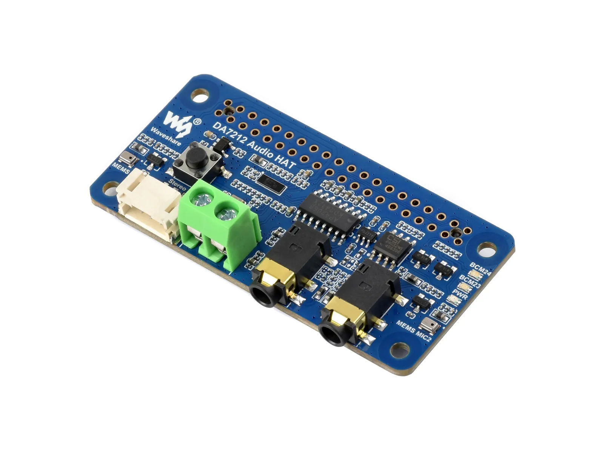

# Waveshare DA7212 Audio Board (A) Product 

[中文](README_ZH.md)

DA7212 Audio Board (A) is an expansion board designed for use with the Raspberry Pi. It offers powerful features and integrates the DA7212 stereo codec chip, supporting a maximum sampling rate of 96 kHz and a maximum resolution of 24-bit. It also comes with a standard 3.5 mm headphone jack, a 3.5 mm AUX input jack, a microphone interface, and multiple speaker interfaces for convenient user connection and operation.

- [Purchase Link](https://www.waveshare.com/DA7212-Audio-Board-A.htm)
- [Documentation](https://docs.waveshare.com/DA7212-Audio-Board-A/)

---

## 🔧 Configuration

You can find detailed configuration information on the product wiki page

---

## 🛠️ Contributing

We welcome contributions! Here’s how you can help:

1. Fork the repository.
2. Create a new branch for your feature or bug fix.
3. Commit your changes with clear descriptions.
4. Submit a pull request for review.

---

## 🧩 Issues and Support

If you encounter any issues:

- Check the [Issues](https://github.com/waveshareteam/da7212-audio-board-a/issues) section.
- Create a new issue with detailed information.
- Refer to the documentation for troubleshooting tips.
- Contact the Waveshare team and provide the order number to obtain technical support.

---

## 📜 License

This repository is licensed under the Apache License License. See the [LICENSE](LICENSE) file for details.

---

## 🙌 Acknowledgments

- Waveshare for their excellent hardware platforms and software support
- The Espressif Team for their continuous support.
- Open-source contributors who make these projects possible.

---

Thank you for using Waveshare Electronics Products! 🚀